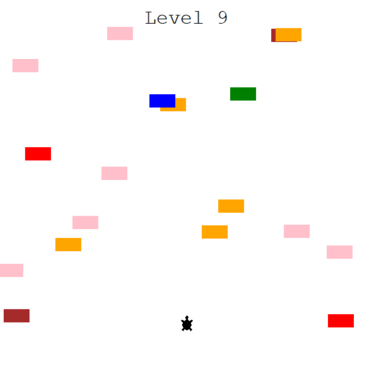

# Python Road Crossing Game
### In this game you need to cross the road while evading the cars with your turtle.
## Usage:
### • You can move only backwards and forwards.
### • Use the Up and down arrows to move the turtle.
### • When failing a level press 'R' to restart the game or click on the screen to exit.



## Installation
```
git clone https://github.com/ShayCohenn/road-crossing-game-python.git
```
```
cd road-crossing-game-python
```
```
py main.py
```